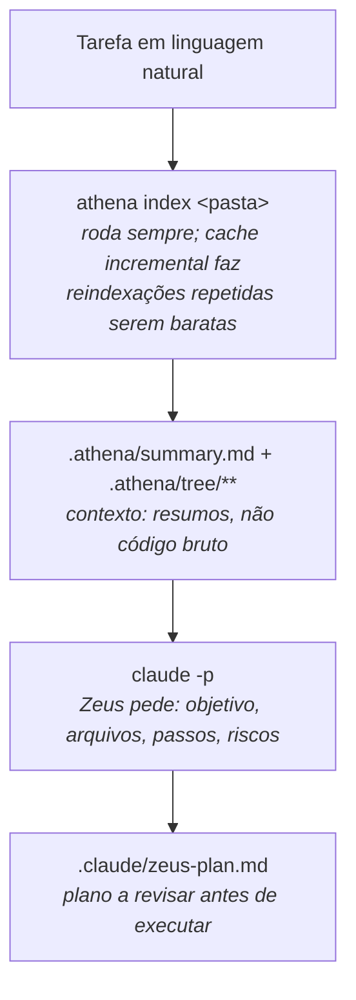

# Zeus


**Antes de mexer em código, saiba quais arquivos realmente importam
— sem adivinhar.**

Você descreve uma tarefa em português mesmo ("adicionar campo de
telefone no cadastro de usuário") e o Zeus cruza isso com o índice de
arquitetura gerado pela [Athena](https://github.com/theroverse/athena)
pra decidir quais arquivos do projeto realmente importam, escrevendo
um plano de ação verificável antes de qualquer linha de código mudar.

O Zeus não lê o código-fonte diretamente: ele passa a tarefa e os
resumos já gerados pela Athena para o [Claude Code](https://claude.com/claude-code)
(`claude -p`), que escolhe os arquivos candidatos e escreve o plano.
O resultado é um ponto de partida a revisar, não uma verdade absoluta.

## Por que usar

- **Você para de adivinhar por onde começar.** Em vez de abrir 15
  arquivos até achar o certo, o Zeus já chega com uma lista curta e
  justificada — ótimo pra quem está aprendendo a navegar num projeto
  grande pela primeira vez.
- **Um plano antes do código.** Objetivo, arquivos, passo a passo e
  riscos, em Markdown, antes de pedir pro Claude (ou você mesmo)
  implementar — dá pra revisar e concordar (ou discordar) antes de
  qualquer mudança acontecer.
- **Não custa nada rodar de novo.** O cache incremental da Athena
  torna reindexações repetidas baratas — o Zeus roda `athena index`
  sozinho antes de cada plano.
- **Parte de uma suíte**: use direto (`python zeus.py plan "..."`) ou
  via [`thero --plan "<tarefa>"`](https://github.com/theroverse/thero),
  que já cuida de instalar o Zeus e a Athena se faltarem.

## Descrição

- Roda `athena index <pasta>` automaticamente antes de planejar — o
  cache incremental da própria Athena faz reindexações repetidas
  serem baratas quando nada mudou.
- Junta o resumo raiz (`.athena/summary.md`) e todos os resumos de
  arquivo/pasta (`.athena/tree/**`) num único contexto, truncando se
  ficar grande demais.
- Pede ao Claude um plano em Markdown com quatro seções fixas:
  Objetivo, Arquivos selecionados, Passo a passo, Riscos.
- Escreve o resultado em `.claude/zeus-plan.md` na raiz do projeto
  planejado (faz backup do anterior, se existir).
- Se a Athena não estiver instalada, oferece clonar automaticamente
  (com confirmação) numa cópia gerenciada compartilhada com o
  [`thero`](https://github.com/theroverse/thero), em vez de exigir
  instalação manual.

## Requisitos

- Python 3.10+ (só biblioteca padrão, sem dependências externas)
- Claude Code instalado e autenticado (`claude -p`)
- git (só necessário se a Athena precisar ser clonada/atualizada
  automaticamente)

## Instalação

```
git clone https://github.com/theroverse/zeus.git
cd zeus
python zeus.py --help
```

## Uso

```
python zeus.py plan "<descrição da tarefa>" [PASTA]
python zeus.py --help
```

```
python zeus.py plan "adicionar campo de telefone no cadastro de usuario"
python zeus.py plan "corrigir bug de paginacao" /caminho/do/projeto
```

`PASTA` é o projeto a planejar (padrão: pasta atual). O plano é escrito
em `<PASTA>/.claude/zeus-plan.md`.

## Como funciona



## Athena

O Zeus precisa da Athena já instalada (ou instalável). Procura
`athena.py` nesta ordem:

1. Variável de ambiente `ZEUS_ATHENA_PATH` (caminho explícito).
2. Pasta irmã `athena/` (layout padrão do monorepo `myscripts`, quando
   `zeus/` e `athena/` ficam lado a lado).
3. Cópia gerenciada em `~/.thero/tools/athena` — clonada (ou
   atualizada, se desatualizada) automaticamente via `git`, com
   confirmação do usuário. Esse local é compartilhado com o `thero`:
   se ele já clonou a Athena ali, o Zeus reaproveita em vez de
   duplicar. Em sessão não interativa (ex.: agente de IA), o
   clone/update automático é pulado em vez de travar esperando
   confirmação.

## Limitações conhecidas

- Escopo mínimo: só o comando `plan`. Não há `zeus.py show` nem
  histórico de planos anteriores.
- A seleção de arquivos depende inteiramente da qualidade dos resumos
  da Athena — um índice desatualizado ou raso gera um plano pior.
- Resumos muito grandes (projetos enormes) são truncados antes de
  chegar ao Claude (`MAX_CONTEXT_CHARS`), o que pode fazer o plano
  ignorar partes do projeto.
- `.claude/zeus-plan.md` é um candidato a verificar, nunca aplicado
  automaticamente — o Zeus não edita código.

## Integração com o Thero e a Athena

O [`thero`](https://github.com/theroverse/thero) (setup do Claude
Code) já reconhece um `.claude/zeus-plan.md` opcional no `CLAUDE.md`
que gera, como ponto de partida de contexto para o Claude — não é
obrigatório rodar o Zeus para usar o `thero`.

## Projeto

```
zeus/
├── zeus.py                    # ponto de entrada (python zeus.py ...)
├── src/zeus/
│   ├── cli.py                   # argparse + orquestração (plan)
│   ├── settings.py               # nomes de arquivo/pasta, limites
│   ├── planner.py                 # orquestra index → contexto → claude → escrita
│   ├── collector.py                 # junta os resumos da Athena num contexto
│   ├── prompts.py                    # prompt de planejamento
│   ├── claude_client.py               # chamada ao "claude -p" (via stdin)
│   ├── athena_bridge.py                # localiza/instala a Athena, roda index
│   └── system/
│       ├── process.py                   # execução de comandos (Windows/POSIX)
│       ├── backup.py                     # backup com timestamp
│       ├── prompt.py                      # confirmação y/n (tty-aware)
│       └── tool_repo.py                    # clone/update genérico via git
├── README.md
└── .gitignore
```

## Autor

**Anthero Vieira Neto**

- E-mail: antherovn@gmail.com
- LinkedIn: https://www.linkedin.com/in/anthero-vieira-neto-aa7a6b8a
- GitHub: http://github.com/netovieira

## Licença

[MIT](./LICENSE)
